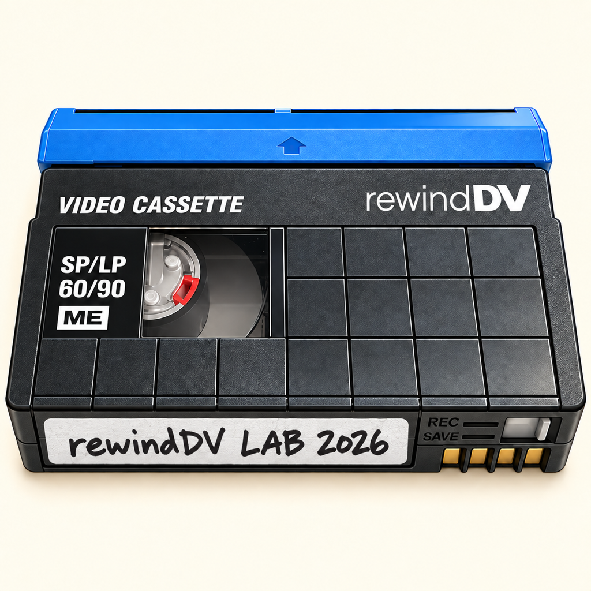

  

<h1 align="center">rewindDV LAB</h1>

<strong>Preserve the tape. Inspect the evidence.</strong> Native MiniDV ingest, playback and preservation tools for Apple Silicon running macOS 26 Tahoe and beyond.

  <a href="https://github.com/bdubs426/rewindDV-LAB/releases">Releases</a> ·
  <a href="INSTALL.md">Installation</a> ·
  <a href="UNINSTALL.md">Remove & restore security</a> ·
  <a href="https://ko-fi.com/rewinddv"><strong>♥ Sponsor this project</strong></a>

> [!TIP]
> ### 
> **[Sponsor rewindDV on Ko-fi →](https://ko-fi.com/rewinddv)**
>
> Help fund IEC standards, additional decks and broader Mac testing.
> Every contribution supports development; downloading and testing remain free.

> [!WARNING]
> **Experimental engineering alpha — not a production release.** This ad-hoc-signed,
> non-notarized build requires disabling System Integrity Protection (SIP) and
> enabling system-extension developer mode. That reduces security across your Mac.
> Use a backed-up test Mac and non-critical tapes, not your only archival copy.
> If you cannot accept those risks, wait for a properly entitled, signed and
> notarized production release. Read the complete installation and removal guides
> **before** changing any security settings.

## Download

**Alpha 0.0.63 · Driver B178 — public engineering alpha.**

[**Download the app ZIP**](https://github.com/bdubs426/rewindDV-LAB/releases/download/alpha-0.0.63/rewindDV-LAB-Alpha-0.0.63-AdHoc.zip)
and its [SHA-256 checksum](https://github.com/bdubs426/rewindDV-LAB/releases/download/alpha-0.0.63/rewindDV-LAB-Alpha-0.0.63-AdHoc.zip.sha256).
Read the [release notes, known issues and qualification limits](RELEASE-NOTES.md).
rewindDV has been successfully tested locally with **Sony HVR-M15U,
Sony HVR-M25AJ, and JVC DV-BR600 MiniDV decks**.

The ZIP contains the app with its embedded driver, readable installation/removal
instructions, optional local support tools, and third-party notices. No Apple
Developer account, Xcode or device registration is needed to test it.

**This repository is a downloads and documentation hub, not the application
source repository.** GitHub's automatic “Source code” ZIP/tar links contain
only this hub's documentation and assets; they do **not** contain the app.
Choose the explicitly named **AdHoc.zip** release asset.

## What rewindDV does

**Apple removed built-in FireWire support with macOS 26 Tahoe in 2025.**
Apple now lists native FireWire support as requiring macOS Sequoia 15 or earlier,
leaving legacy DV decks and camcorders without that built-in connection path on
Tahoe and later macOS versions. [Apple's FireWire compatibility guidance](https://support.apple.com/en-us/109523#firewire)

rewindDV restores a DV-focused FireWire acquisition path for Apple Silicon,
so existing tapes and working decks can remain part of a modern preservation workflow.

rewindDV brings DV tape acquisition and careful inspection into one native Mac
workspace. It preserves received DV data and separates transport-loss evidence,
source-content defects and preview-only issues rather than hiding them behind
a single “success” message.

- **Capture:** manual ingest or whole tape automated rewind & capture.
  Missing timecode or a blank
  stretch does not, by itself, end capture. Physical stop observations are not
  infallible proof of BOT/EOT; hardware and operator intervention matter.
- **Live monitoring and deck control:** picture, audio meters, source timecode,
  approximate play elapsed time, Play/Stop, rewind/fast-forward and supported
  forward/reverse picture search. Physical deck controls and GUI controls work
  together on tested equipment.
- **Verify before disconnecting:** reconstruction/reread progress, saved-byte
  integrity checks, retained receive evidence and completion/attention
  notifications on your Mac. Notifications are local—not email or mobile push.
- **Native DV playback and inspection:** responsive scrubbing, field-oriented
  viewing options, 1×/2×/4×/8× zoom and navigator, preview-only 4:3/16:9 overrides,
  and measured highlight/shadow signal-limit overlays. These controls do not
  rewrite the captured DV. Signal limits do not prove unrecoverable clipping.
- **Metadata:** technical video/audio specifications, recorded date/time,
  timecode, aspect-ratio evidence and decoded DV metadata with raw provenance.
  Missing, invalid, conflicting and historical observations remain distinct.
- **Analysis & Recovery:** tape maps and frame/block inspection, portable
  reports, previewed scene segmentation, bounded recovery planning with wear
  accounting, and multi-pass comparison/verified merge tools. These are advanced
  alpha workflows with conservative eligibility checks—not guaranteed repair.
- **Local flight recorder:** bounded diagnostic evidence and support export
  to help explain failures without automatically uploading footage or logs.

## Compatibility and honest limits

| Area | Current scope |
|---|---|
| Mac | Apple Silicon only; Intel unsupported |
| macOS | Minimum 26; built with Xcode 27. macOS 27 runtime is not yet qualified |
| FireWire controller | Current driver matches PCI **11c1:5901**, used in the tested Apple Thunderbolt-to-FireWire adapter chain |
| Source | DV25 over IEEE 1394 from a compatible deck/camcorder; select DV output (HDV coming soon; not included in this release) |
| Other FireWire products | Not an audio-interface or SCSI/storage driver |
| Destination | Local/external SSD recommended; APFS, HFS+ or exFAT. Avoid FAT32 and unqualified network volumes |

No RECORD or tape-erasure control is provided. Tape wear, deck faults, software
failures, storage stalls and source defects remain possible. Do not run another
experimental FireWire driver against the same controller at the same time.
Keep physical STOP accessible during initial tests.

**Verified saved bytes do not prove flawless source content or unconditional
lossless acquisition.** Known loss and uncertainty remain visible. Preserve
your original tapes and acquisition evidence; never replace a master with a
recovery derivative merely because it looks better.

## Install, test and report

1. Read [Installation](INSTALL.md) and [Remove & restore security](UNINSTALL.md).
2. Download the named release ZIP and verify its checksum.
3. Follow the deliberate Recovery/Terminal steps, install the app in Applications,
   activate driver extension build 178 in Diagnostics, and verify readiness after any requested reboot.
4. Start with two short Play/Stop cycles, then a short manual capture and saved-file
   playback. Only then try supervised whole-tape capture.
5. Use the [test report template](TEST-REPORT.md), including successful tests.

Public [issues](https://github.com/bdubs426/rewindDV-LAB/issues) are for sanitized
bug summaries and compatibility reports. **Do not attach support ZIPs, raw logs,
private footage, personal paths or deck identifiers publicly.** Ask for a private
transfer channel first. See [Privacy & support evidence](PRIVACY.md).

## Built on open-source work

rewindDV uses a modified **[ASFireWire](https://github.com/mrmidi/ASFireWire)**
driver foundation. It also incorporates selected DV metadata mappings adapted
from **[MediaInfoLib](https://github.com/MediaArea/MediaInfoLib)** and nominal
DV-block geometry adapted from **[DVRescue](https://github.com/mipops/dvrescue)**.
Those contributions are credited explicitly; rewindDV is not an official
release of, or endorsed by, those projects.

See [Acknowledgments](ACKNOWLEDGMENTS.md), [Apache-2.0 license](ASFireWire-LICENSE.txt),
[ASFireWire notices](ASFireWire-NOTICE.txt) and [third-party notices and BSD terms](ThirdPartyNotices.txt).

## ♥ Sponsor this project

Help fund access to **IEC technical standards**, additional decks/camcorders,
adapters and cross-Mac testing. Better references and broader physical tests
help us make preservation decisions with evidence rather than guesswork.

### [Support rewindDV on Ko-fi →](https://ko-fi.com/rewinddv)

No payment is required to download or test
this alpha. Contributions will not buy guaranteed compatibility, recovery,
Apple entitlement approval or a release date. Purchased standards will not be
redistributed through this repository.
